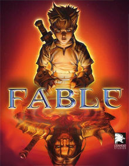
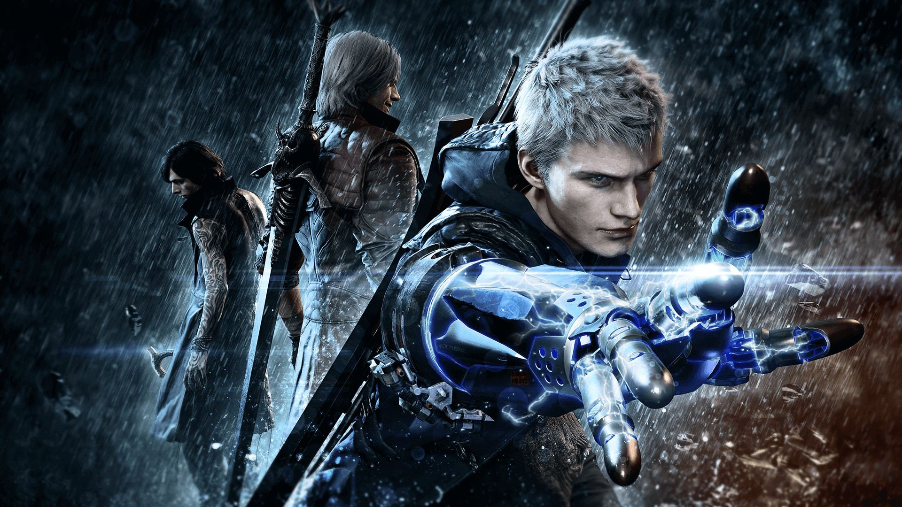

<h1 style="color:#0000ff;">About Me</h1>

My name is Emre Arslan. My student number at RMIT is 3871392 and my e-mail address is: S3871392@student.rmit.edu.au. I was born in Australia, in Clayton to be precise. When I turned 2 years old, my family and I moved overseas to Turkey. The reason we moved to Turkey is due to my parents both being Turkish. We lived in Izmir for around 6 years and then returned to Australia. Due to my background, I can speak, read, and write fluent English and Turkish. The highest level of education I have completed is Year 12 VCE. A fun little fact about me is that I taught in China as an English Teacher about 2 years ago, and met my fiancée who traveled from Melbourne as well for the same purpose. We somehow ended up in the same city, with the same employer, with the same job. 

<h1 style="color:#00ffff;">Interest in IT</h1>

My interest in IT started when I was around 10 years old. It all began when my father’s friend who worked in IT brought a computer over to our house for us to use. He and my father set it up and played a bit of Prince of Persia: The Sands of Time and Max Payne. I had a PlayStation at the time, so I was aware that video games existed. However, I always thought that computers were used for business purposes only. Over the years my interest in computers and IT in general grew more. I learnt how to build my own computer, trouble-shoot issues, and use a computer efficiently. I chose to come to RMIT to start my IT journey. With RMIT being a strong contender in IT courses, I decided it would be the best option for me. At RMIT, I expect to become efficient in creating code and creating software. I want to be able to write programs to benefit myself and others.

<h1 style="color:#00ff00;">Ideal Job</h1>

Ideally, I would like to be a game developer. I honestly expect this to change as I continue my studies in IT but as it stands it is what I am aiming or. I have grown up around video games ever since I was 6 years old. From my first Sega console, to a PlayStation, then an Xbox, and lastly my own personal computer. Video games provide me with relaxation, joy, and a little bit of addiction. Video games can express many emotions, ideas, philosophies, and art. I believe there are endless possibilities when it comes to what you can do with a video game, and I want to create something that will stand out. Here is an advertisement on Seek.com.au about being a game developer: Game Developer Job Advertisement. The position itself entails writing code to introduce new technologies in the game engines that are used. The aspect of creating something to be used by future game studios appeals quite a lot to me. However this job would not be ideal for someone who has just finished their studies, as they require minimum of 3 years demonstrated experience in Unity & Unreal Engine 4, experience in a AAA game studio which you have worked on a published game, C++, C#, JavaScript knowledge, CPU optimization for multi-threaded programming, and specific game engine knowledge for shaders. Since their projects also need to be ported to iOS, Android, Xbox One, and PS4, they require the ideal candidate to possess knowledge and experience in deploying and testing on these platforms. They mention Lumberyard and CryEngine as game engines, also SideFX: Houdini which is a 3D procedural software to create models, animations and render. Currently, I do not possess any knowledge regarding any of these requirements. I am currently learning about programming using JavaScript, however the knowledge this company requires is far greater and in-depth. Once I have finished this course and completed my Bachelor of IT, I expect to have enough knowledge about C++, C# and JavaScript. The next step would be to learn about Unity and Unreal Engine 4. There are numerous publicly available tutorials online on how to use this software. Once I am proficient in these, then I would need to investigate how to develop games for mobile platforms, as it would be different than just developing games for gaming consoles or computers.

<h1 style="color:#ffff00;">Personal Profile</h1>

The Myers-Briggs test showed my personality type as Advocate INFJ-A. The learning style test advised me that I was a ‘Tactile learner’. The Big Five Personality test advised that I am highly agreeable and open. These results seem to fit one another. I am passionate and empathetic; I also have vivid imagination. I value my principles and integrity. Above all this, I have the willpower to turn my dreams and ideals into plans and execute them. When it comes to learning, I need to do things myself. I am a hands-on type of learner. I like taking things apart and putting things together. I like to tinker when I am bored. 

When it comes to teamwork I work well with people, but I am very systematic. In a team environment I like to be organized and have well thought-out plans. I enjoy being prepared and would need teammates who are also organized. 

When forming a team, I need to be aware that not everyone thinks and learns the way that I do. I understand that I will need to be patient and accepting of criticism. Since I like to form plans, I will have to be open to ideas and perhaps even conflict. This can be resolved by exchanging ideas in a respectable manner.

<h1 style="color:#ff7d00;">Project Idea</h1>

For my project idea, I have had this thought for quite a while. I enjoy playing video games, since I was a child. I also enjoy openness and creativity. I want to create an action-adventure video game set in an open-world environment and able to be played from both a first-person and third-person perspective. The player will control a protagonist in a modern-day city. The protagonist will inherit supernatural powers, but this depends on the choices the player initially makes. I want to design it as such that players will be able to explore their creativity and unleash their imagination.

There have been countless open-world games created up until now. There is evidence of their success, players do not like having limits. In the list of ‘Best Video Games of All Time’ on Metacritic, out of the top 20 video games 15+ are open-world. The top-rated game is The Legend of Zelda: Ocarina of Time, which laid the foundation for today’s massive open world journeys. Players do not like restrictions, whether be it the level itself, the tools you can use or even tactics. People want something different, something that they can dictate. That is why these games have been massively successful. They let you take the reins and do what you wish. Take the Grand Theft Auto series for example, do you want to drive around for hours in the city listening to the radio? Do you want to play bowling, golf, or tennis? Do you want to shop for clothing for your character? Or would you rather test out some weapons in a gun range? Grand Theft Auto lets you do these things and does not make you feel claustrophobic as if you are running out of space to do them in. 

As for the game itself, what I have imagined is similar to the typical super-hero story lines. However instead of it being a linear progression, players will have the ability to customize almost every aspect of their gameplay. To start with, the player will begin their journey during the early childhood years of their protagonist. One game that did this well was Fable, where the childhood sequence introduced the controls, the morality system, and the user interface. This will be the introduction to gameplay and mechanics. The player can choose their gender, race, and customize their characters features. The protagonist will have choices to make during this childhood sequence, which the outcome will determine their starting supernatural power. These powers will be used for movement, offense, and defense. 

The movement and traversal aspect of the game will also be highly customizable. As an example, if the player started with the power of water then they can choose to turn into liquid and travel through the sewer system of the city, or they can freeze their water into ice and travel like Iceman from the X-Men. If the player chose electricity, they could travel along the power lines by turning into pure energy, or even turn into lightning and travel through thunder clouds. The player will be able to choose natural elements and going further than that, darkness, light, magic, and psychokinesis. The video game will also feature a morality system, which will affect how citizens treat you. If the player commits evil acts, this will result in citizens being scared around the protagonist. As with good deeds, citizens will want to take pictures and crowd around the protagonist. The storyline will revolve around an organization that researches human augmentation. This organization will be the main antagonist. The goal of the organization is to implant controlling chips into their test subjects in order to gain power over the city. 

This project will be aiming for the new generation of consoles, specifically PS5 and Xbox Series X and PC. The project will aim to allow modification of the game files itself, as has been done with The Elder Scrolls V: Skyrim, The Witcher 3 and Fallout 4. This will allow users to adjust the game mechanics, graphics, tools, and functions of the game. The modding community of Skyrim for example is huge. There are new mods every day, even now as we speak currently 64,600 mods exist on <a href="https://www.nexusmods.com/">NexusMods.com</a>.
Another part of this project will be the music. The music needs to feature quite a lot of separate tracks in order to make the gameplay feel more vivid. For example, the video game Devil May Cry 5 contains 136 tracks in total, all from various artists. This collaboration has made Devil May Cry a great game as there is a lot of variety with the soundtrack. Action sequences will need to feature fast paced music, and dialogue sequences will need to feature slower music.

In order to complete this project, there is a vast requirement of software. The game engine to be used will be Unreal Engine, as it has the ability to make games into very unique experiences. For example, Bioshock a first-person action game and Batman: Arkham series, a third-person open-world adventure game are both made using Unreal Engine. The game engine is the most important aspect as it controls things like physics, input, rendering, scripting, collision detection and artificial intelligence to name a few.
There is also the importance of the skills to create a video game. Firstly, since Unreal Engine will be the game engine that is going to be used, we need to be proficient enough to create models, textures, and scripting. Since Unreal Engine is quite a popular software, there are numerous guides available online to help. Secondly, the software itself being Unreal Engine, it is free to download and use. If your video game is successful, and your lifetime gross revenue from the video game exceed one million dollars, then you incur a 5% royalty. There is also a need for a music producer in order to create memorable and mesmerizing soundtracks. This can be accomplished by posting an ad on Seek.com.au, visiting a recording studio, or contacting a music producer directly.
If this project is successful, it will bring something new to the gaming world. It will open doors and avenues to different projects, and show to other companies what consumers, specifically gamers, really want out of their games. The open-world genre is becoming more and more popular, however there are still certain aspects that are lacking like in-detail customization. All gamers play games to have fun, enjoy themselves and escape reality, even if it is for a few minutes. This project will allow gamers to free their minds and explore their creativity.

### References
[1]"Best Video Games of All Time", Metacritic, 2020. [Online]. Available: https://www.metacritic.com/browse/games/score/metascore/all/all/filtered. [Accessed: 19- Sep- 2020].

[2]"The Big Five Personality Test", Truity, 2020. [Online]. Available: https://www.truity.com/test/big-five-personality-test. [Accessed: 19- Sep- 2020].

[3]"What's Your Learning Style? 20 Questions", Educationplanner.org, 2020. [Online]. Available: http://www.educationplanner.org/students/self-assessments/learning-styles-quiz.shtml. [Accessed: 19- Sep- 2020].

[4]"Free personality test | 16Personalities", 16Personalities, 2020. [Online]. Available: https://www.16personalities.com/free-personality-test. [Accessed: 19- Sep- 2020].

-
